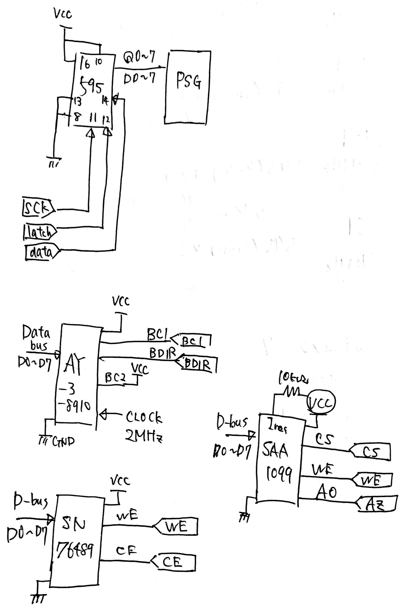

Arduino_STM32_PSG
====

PSG IC Control library for Arduino / STM32duino

## Description

ArduinoやSTM32duino（blue Pill）でPSG音源チップを鳴らすためのライブラリ

AY-3-8910（とその派生）/SN76489/SAA1099 に対応

## Requirement

- PSG音源チップ（使うやつ）
- マイコン （Blue Pillで動作確認）
- 74hc595（シフトレジスタ）
- クリスタルオシレータなどのクロック源

## Usage

書き忘れましたが、SN76489のクロックは4MHz,SAA1099のクロックは8MHzです。
私は4040で8MHzを分周して使っていました。

## Licence

[MIT](https://github.com/Bongorian/Arduino_STM32_PSG/blob/master/LICENSE)

## Author

[bongorian](https://github.com/Bongorian)

